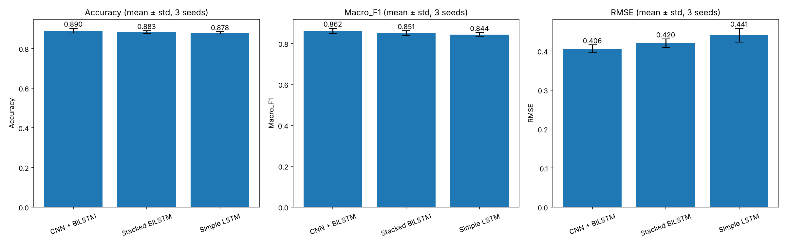
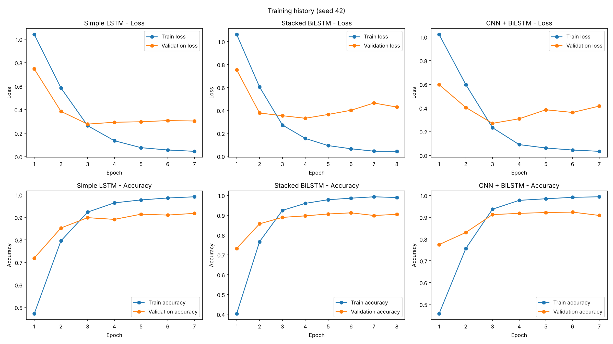
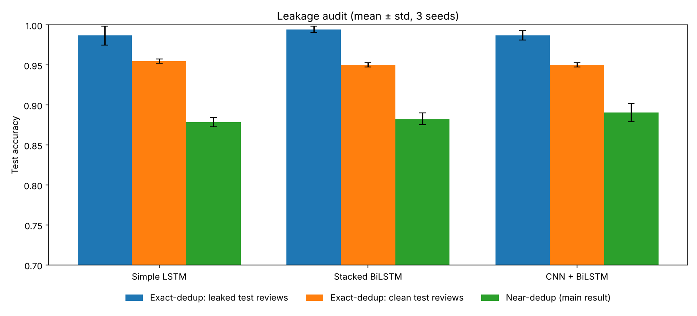
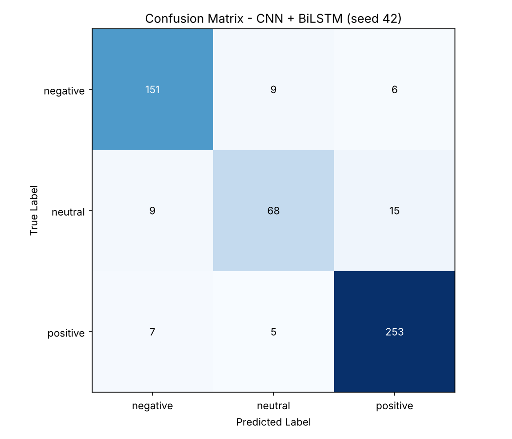

# Hindi/Hinglish Sentiment Analysis

A deep learning project for **sentiment classification of Hindi/Hinglish review text** using LSTM-based architectures. The project implements and compares **Simple LSTM, Stacked BiLSTM, and CNN + BiLSTM** models for classifying text into sentiment categories.

## 📌 Project Overview

Hindi and Hinglish text often contains a mixture of Hindi and English words, making sentiment analysis challenging for traditional NLP models.

This project explores different deep learning architectures for sentiment classification and evaluates their performance using multiple metrics.

### Models Implemented

- **Simple LSTM** — Baseline recurrent neural network model
- **Stacked BiLSTM** — Multiple bidirectional LSTM layers for richer contextual representation
- **CNN + BiLSTM** — CNN for extracting local textual patterns followed by BiLSTM for sequential context modeling

The models are compared based on classification performance and computational complexity.

---

## 🎯 Objectives

- Perform sentiment analysis on Hindi/Hinglish text.
- Preprocess and tokenize review text for deep learning.
- Implement a **Simple LSTM** sentiment classifier.
- Implement a **Stacked BiLSTM** architecture.
- Implement a **CNN + BiLSTM** hybrid architecture.
- Compare the models using standard evaluation metrics.
- Analyze the trade-off between performance and model complexity.

---

## ❓ Research Questions

| # | Question | Short answer (details in Experimental Results) |
|---|---|---|
| **RQ1** | On code-mixed Roman Hindi / Roman Urdu / English product reviews, does a more complex architecture (Stacked BiLSTM, CNN + BiLSTM) beat a single-layer LSTM on accuracy, macro F1 and RMSE? | **Only slightly.** On the deduplicated data, CNN + BiLSTM is best (89.0% accuracy, 0.862 macro F1), but all three models are within about 1.2 accuracy points, roughly one standard deviation. |
| **RQ2** | How much do the results change with the random seed, and would a single run give a misleading ranking? | The standard deviation is 0.6–1.2 accuracy points, as large as the gaps between models. **A single run could rank the models in any order.** |
| **RQ3** | Does the padding direction (pre vs post) affect one-directional and bidirectional LSTMs differently? | **Yes.** Post-padding made the Simple LSTM fail on 2 of 3 seeds (70% ± 24 accuracy); pre-padding fixed it. The BiLSTM models changed by only about 1 point. This replicates Dwarampudi & Reddy (2019) on code-mixed data. |
| **RQ4** | Which kinds of input do the models get wrong beyond the test set: negation, mixed opinions, sarcasm, spelling variants, very short inputs, Devanagari script? | Clear sentiment, spelling variants, mixed opinions and the sarcasm case are handled. **Double negation fails in every model**, and **Devanagari input is not supported** because the training data is entirely Roman script. |
| **RQ5** | Does the dataset contain near-duplicate (augmented) reviews, and how much do they inflate test scores if only exact duplicates are removed? | **Yes, heavily.** 27% of the distinct reviews are augmented copies, and with exact-duplicate removal only, 42% of test reviews have a near-copy in the training data. This inflates accuracy from about **88%** to about **97%**. |

---

## 🗂️ Project Structure

```text
hinglish-sentiment-model-comparison/
│
├── data/
│   └── hinglish_reviews.csv
│
├── notebooks/
│   └── sentiment_analysis.ipynb
│
├── models/
│   ├── simple_lstm.py
│   ├── stacked_bilstm.py
│   └── cnn_bilstm.py
│
├── results/
│   ├── architecture_comparison.csv   # mean ± std per architecture
│   ├── architecture_runs.csv         # one row per architecture × seed
│   ├── padding_ablation.csv          # pre- vs post-padding, mean ± std
│   ├── leakage_audit.csv             # exact- vs near-duplicate removal, mean ± std
│   ├── leakage_audit_runs.csv        # one row per architecture × seed
│   ├── leakage_audit.png
│   ├── architecture_comparison.png
│   ├── confusion_matrix.png
│   ├── training_history.png
│   ├── tokenizer.json
│   ├── label_classes.json
│   └── best_model.keras        # created by train.py (not tracked)
│
├── preprocessing.py
├── train.py
├── predict.py
├── requirements.txt
├── README.md
└── .gitignore
```

---

## 🔄 Methodology

The overall workflow is:

```text
Hindi/Hinglish Reviews
        ↓
Text Cleaning
        ↓
Tokenization
        ↓
Sequence Padding
        ↓
Word Embedding
        ↓
Deep Learning Model
        ↓
Sentiment Prediction
        ↓
Model Evaluation
```

### Preprocessing

The text data is processed before being provided to the neural networks. The preprocessing pipeline includes:

1. Removal of empty reviews
2. Text cleaning (`preprocessing.clean_text`): URLs and @mentions are removed, only Devanagari, Latin letters, and digits are kept, text is lowercased, and whitespace is collapsed
3. **Near-duplicate removal** (`preprocessing.dedup_key`). The dataset contains augmented copies of reviews: the same review with a stock English phrase inserted (*"to be honest,"*, *"i would like to mention that"*, *"based on my purchase,"* and 12 others) and/or its sentences shuffled. Each review gets a key made by removing those phrases and sorting the remaining words; one review is kept per key, and keys with conflicting labels are dropped. This reduces 4,781 distinct cleaned reviews to **3,486**, and an assertion in the code checks that no key is shared between the training, validation and test sets (see the leakage audit under Experimental Results)
4. Stratified 70 / 15 / 15 split into training, validation, and test sets
5. Tokenization with a Keras `Tokenizer` (vocabulary of 20,000, `<OOV>` token) fitted on the training set only
6. **Pre-padding** (zeros added before the review) and truncation to 60 tokens. The median review is only 18 tokens, so a review typically gets about 42 padding steps. With pre-padding, the LSTM reads the real words last, so its final hidden state reflects the review rather than the padding. Only 3% of reviews are longer than 60 tokens and get cut
7. Balanced class weights to offset class imbalance

The same `clean_text` function is applied in `predict.py`, so new reviews are preprocessed exactly as the training data was.

---

## 🧠 Model Architectures

### 1. Simple LSTM

The Simple LSTM acts as the baseline model.

```text
Input Text (60 tokens)
    ↓
Embedding (128-d)
    ↓
SpatialDropout1D (0.3)
    ↓
LSTM (64 units, dropout 0.3, recurrent dropout 0.2)
    ↓
Dense (32, ReLU)
    ↓
Dropout (0.3)
    ↓
Dense (3, Softmax)
    ↓
Sentiment
```

LSTM is useful for capturing sequential dependencies in text while reducing the vanishing-gradient problems associated with traditional RNNs.

### 2. Stacked BiLSTM

The Stacked BiLSTM uses multiple bidirectional LSTM layers.

```text
Input Text (60 tokens)
    ↓
Embedding (128-d)
    ↓
SpatialDropout1D (0.3)
    ↓
BiLSTM (64 units per direction, return sequences, dropout 0.3, recurrent dropout 0.2)
    ↓
BiLSTM (32 units per direction, dropout 0.3, recurrent dropout 0.2)
    ↓
Dense (32, ReLU)
    ↓
Dropout (0.3)
    ↓
Dense (3, Softmax)
    ↓
Sentiment
```

The bidirectional architecture processes the sequence in both forward and backward directions, allowing the model to use contextual information from both sides of a word.

### 3. CNN + BiLSTM

The hybrid architecture combines convolutional feature extraction with bidirectional sequence modeling.

```text
Input Text (60 tokens)
    ↓
Embedding (128-d)
    ↓
SpatialDropout1D (0.3)
    ↓
Conv1D (64 filters, kernel 5, ReLU)
    ↓
MaxPooling1D (pool size 2)
    ↓
BiLSTM (64 units per direction, dropout 0.3, recurrent dropout 0.2)
    ↓
Dense (32, ReLU)
    ↓
Dropout (0.3)
    ↓
Dense (3, Softmax)
    ↓
Sentiment
```

The CNN extracts local patterns and important n-gram-like features, while the BiLSTM captures contextual and sequential relationships. MaxPooling halves the sequence length before the BiLSTM, which makes it cheaper to run.

All three models share the same embedding size, dropout settings, optimizer (Adam, learning rate 1e-3) and loss (sparse categorical cross-entropy), so the comparison isolates the effect of the architecture.

---

## 📊 Experimental Results

Test-set results from `results/architecture_comparison.csv`, after near-duplicate removal. Each architecture was trained **3 times (seeds 42, 123, 2024)** on the same fixed train/validation/test split (2,440 / 523 / 523 reviews), and the table shows **mean ± standard deviation** across the 3 runs. Results for each run are in `results/architecture_runs.csv`.

| Model | Accuracy | Macro F1 | Weighted F1 | RMSE | Parameters | Mean epochs |
|---|---:|---:|---:|---:|---:|---:|
| Simple LSTM | 87.83% ± 0.58 | 84.40% ± 0.93 | 87.77% ± 0.67 | 0.441 ± 0.018 | 577,411 | 7.0 |
| Stacked BiLSTM | 88.27% ± 0.72 | 85.09% ± 1.16 | 88.35% ± 0.80 | 0.420 ± 0.011 | 668,035 | 8.0 |
| CNN + BiLSTM | **89.04% ± 1.15** | **86.18% ± 1.26** | **89.15% ± 0.89** | **0.406 ± 0.010** | 637,123 | 7.0 |

Each model trains for up to 25 epochs with early stopping (patience 4 on validation loss), so the epoch counts differ.

**Findings**

- **CNN + BiLSTM is best on every metric, but only by a small margin.** All three models are within about 1.2 accuracy points of each other, roughly one standard deviation, so with 3 seeds the ranking is not statistically reliable. The convolution's n-gram features (e.g. *paisa barbaad*, *mat kharido*) give a small, consistent edge in RMSE.
- **Neutral is the hardest class.** For the best run (CNN + BiLSTM, seed 42: 90.25% accuracy, 0.876 macro F1, saved as `results/best_model.keras`), F1 is 0.94 for positive, 0.91 for negative but only 0.78 for neutral; neutral reviews are often mixed or mild (*"theek hai"*, *"average"*).
- **Overfitting:** in `results/training_history.png`, training loss falls towards 0 while validation loss reaches its minimum around epoch 3 and then rises. Early stopping with `restore_best_weights=True` keeps the weights from the lowest validation loss.

### Leakage audit (RQ5)

While checking the data, we found that many reviews appear more than once with small changes: a stock English phrase added at the start or in the middle, or the sentences in a different order. For example:

> *cap ka size chart galat hai, order karne se pehle batao.*
> *basically, cap ka size chart galat hai, order karne se pehle batao.*

| | Count |
|---|---:|
| Distinct reviews after cleaning (exact duplicates removed) | 4,781 |
| Reviews containing one of the 15 stock phrases | 1,355 |
| Groups of near-duplicates (2 to 7 copies each) | 895 |
| Reviews left after near-duplicate removal | **3,486** (27% fewer) |

The augmented groups are skewed towards the minority classes (37% negative and 25% neutral, compared with 30% and 15% among reviews that were not copied), so the copies look like class-balancing augmentation.

To measure the effect, the full experiment is re-run with **exact-duplicate removal only** (section 14 of the notebook). With that split, **304 of 718 test reviews (42%) have a near-copy in the training or validation data.** Results are in `results/leakage_audit.csv`:

| Model | Exact-dedup: all test | Exact-dedup: leaked test reviews | Exact-dedup: other test reviews | **Near-dedup (honest result)** |
|---|---:|---:|---:|---:|
| Simple LSTM | 96.84% ± 0.40 | 98.68% ± 1.19 | 95.49% ± 0.28 | **87.83% ± 0.58** |
| Stacked BiLSTM | 96.89% ± 0.16 | 99.45% ± 0.38 | 95.01% ± 0.28 | **88.27% ± 0.72** |
| CNN + BiLSTM | 96.56% ± 0.40 | 98.68% ± 0.57 | 95.01% ± 0.28 | **89.04% ± 1.15** |

- **Removing only exact duplicates inflates accuracy by about 8–9 points** (97% vs 88%). On test reviews with a near-copy in training, the models score 99%: they recognise the review rather than judge its sentiment.
- Even the test reviews *without* a near-copy score about 95%, well above the honest 88%. They are not a fair sample: the copied reviews are mostly the harder negative and neutral ones, so the reviews left over are easier, mostly positive ones.
- **With exact-duplicate removal only, the three models are indistinguishable** (96.6–96.9%); the small advantage of CNN + BiLSTM only appears on the deduplicated data.
- Any result on this dataset that removes only exact duplicates (or none) should be read with this in mind. Our own earlier version of this project reported 96–97% for that reason.

### Padding ablation (RQ3)

The same experiment (same data split, seeds and settings) was run twice, changing only the padding direction. *This ablation was run before the near-duplicate problem was found, so it uses exact-duplicate removal only; the absolute accuracies are inflated, but both settings share the same split, so the comparison between them is fair.* Full numbers are in `results/padding_ablation.csv`.

| Model | Accuracy, post-padding | Accuracy, pre-padding | Macro F1, post-padding | Macro F1, pre-padding |
|---|---:|---:|---:|---:|
| Simple LSTM | 70.06% ± 23.71 | **96.61% ± 0.29** | 62.58% ± 29.30 | **95.95% ± 0.32** |
| Stacked BiLSTM | **96.42% ± 0.85** | 95.35% ± 1.03 | **95.84% ± 1.07** | 94.51% ± 1.06 |
| CNN + BiLSTM | 95.17% ± 1.43 | **96.47% ± 0.43** | 94.21% ± 1.65 | **95.70% ± 0.38** |

- Padding direction only matters a lot for the **one-directional** LSTM. With post-padding, its final state comes after about 42 zero steps, and on 2 of 3 seeds the training loss stayed at chance level for 10+ epochs.
- For the two bidirectional models, the change is about 1 point in either direction, which is about the size of one standard deviation. With only 3 seeds, this is not a reliable difference.
- This agrees with Dwarampudi & Reddy (2019), who found that post-padding cut LSTM test accuracy from 80.3% to 50.1% on English tweets while CNN accuracy was unaffected. Here the failure showed up as **seed-dependent instability** (one of three seeds still trained well), which a single run could hide.

### Charts

**Model comparison** (mean ± std over 3 seeds)



**Training vs validation loss and accuracy** (seed 42)



**Leakage audit:** exact-duplicate removal vs near-duplicate removal



**Confusion matrix of the best model** (CNN + BiLSTM, seed 42)



### Hand-written test cases

The notebook (section 14) also tests the models on 21 new reviews written for this purpose, grouped into categories that are hard for sentiment models. Each architecture uses its best seed.

| Category | Review | Expected | Simple LSTM | Stacked BiLSTM | CNN + BiLSTM |
|---|---|---|---|---|---|
| Clear positive | product bahut accha hai, quality bhi badhiya hai | positive | ✓ | ✓ | ✓ |
| Clear positive | bohat zabardast cheez hai, seller ne time pe deliver kiya | positive | ✓ | ✓ | ✓ |
| Clear negative | bilkul bekaar product hai, paisa barbaad ho gaya | negative | ✓ | ✓ | ✓ |
| Clear negative | ghatiya quality hai, kabhi mat lena | negative | ✓ | ✓ | ✓ |
| Clear neutral | theek hai, price ke hisaab se average hai | neutral | ✓ | ✓ | ✓ |
| Clear neutral | product ok hai, na zyada acha na zyada bura | neutral | ✓ | ✓ | ✓ |
| English only | excellent product, very good quality, highly recommended | positive | ✓ | ✓ | ✓ |
| English only | worst product ever, totally waste of money | negative | ✓ | ✓ | ✓ |
| English only | it is okay, works as described, nothing special | neutral | ✓ | ✓ | ✓ |
| Negation | bilkul bhi acha nahi hai | negative | ✓ | ✓ | ✓ |
| Negation | koi problem nahi hai, sab sahi chal raha hai | positive | ✗ negative | ✗ negative | ✗ negative |
| Mixed opinion | quality achi hai lekin delivery bahut late thi | neutral | ✓ | ✓ | ✓ |
| Sarcasm | wah kya baat hai, do din mein hi toot gaya | negative | ✓ | ✓ | ✓ |
| Spelling variant | bht acha h yr, mza agya | positive | ✓ | ✓ | ✓ |
| Spelling variant | bkwas h bhai, pesy zaya | negative | ✓ | ✓ | ✓ |
| Very short | acha | positive | ✓ | ✓ | ✓ |
| Very short | bekar | negative | ✓ | ✓ | ✓ |
| Caps / emoji | SUPERB!!! 😍😍 must buy | positive | ✓ | ✓ | ✓ |
| Domain: size | size chart galat hai, chhota aa gaya, return karna padega | negative | ✓ | ✓ | ✓ |
| Devanagari Hindi | यह प्रोडक्ट बहुत अच्छा है | positive | ✗ negative | ✗ neutral | ✗ negative |
| Devanagari Hindi | बहुत खराब क्वालिटी है, पैसे बर्बाद | negative | ✓* | ✗ neutral | ✓* |
| **Total** | | | **19 / 21** | **18 / 21** | **19 / 21** |

\* A lucky guess: none of the Devanagari words are in the vocabulary, so the model only sees unknown-word tokens.

What the cases show:

- **Strong points:** clear sentiment in Roman Hindi, Roman Urdu and English; spelling variants (*bht*, *bkwas*, *mza*); caps and emoji; mixed opinions; and the sarcasm case (the words *toot gaya* outweigh *wah kya baat hai*).
- **Double negation fails in every model.** In *"koi problem nahi hai"* the words *problem* and *nahi* each signal a complaint, and the models do not learn that together they mean "no problems". Simple negation (*"acha nahi hai"*) is handled correctly.
- **Devanagari script is not supported.** The dataset is entirely Roman-script, so every Devanagari word is unknown to the tokenizer and the predictions are guesses. Supporting Hindi script would need Devanagari training data or transliteration to Roman script before prediction.
- **Very short inputs** (*acha*, *bekar*) are classified correctly, but with low confidence (42–91%).

---

## 📈 Evaluation Metrics

The models are evaluated using:

- **Accuracy** — Overall proportion of correctly classified samples.
- **Precision / Recall** — Per-class values, printed in the classification report during training.
- **Macro-F1** — Average F1-score across sentiment classes (used to rank the models).
- **Weighted-F1** — F1-score weighted according to class frequency.
- **RMSE** — Root Mean Squared Error between predicted and true label indices (negative = 0, neutral = 1, positive = 2). This is only a rough ordinal proxy.
- **Confusion Matrix** — Class-wise visualization of the best model's predictions.
- **Training curves** — Training vs validation loss and accuracy per epoch (`results/training_history.png`). A widening gap between training and validation loss shows overfitting.

---

## 🛠️ Technologies Used

- Python
- TensorFlow / Keras
- NumPy
- Pandas
- Scikit-learn
- Matplotlib
- Jupyter Notebook

---

## ⚙️ Installation

Clone the repository:

```bash
git clone https://github.com/sheetalambre-ai/hinglish-sentiment-model-comparison.git
cd hinglish-sentiment-model-comparison
```

Install the required dependencies:

```bash
pip install -r requirements.txt
```

---

## 🚀 Running the Project

Place the dataset at `data/hinglish_reviews.csv`, with a `Review` column (text) and a `Sentiment` column (`negative`, `neutral`, or `positive`).

Train and compare all three architectures:

```bash
python train.py
```

This trains each architecture with 3 seeds and writes the per-run and mean ± std comparison tables, charts, best model, tokenizer, and label classes to `results/`.

Classify new reviews interactively with the best model:

```bash
python predict.py
```

The files in `models/` define the architectures only; they are imported by `train.py` and are not run on their own.

The full experiment is also in `notebooks/sentiment_analysis.ipynb`, which runs the same code as `train.py` step by step, with every cell's output saved (model summaries, per-epoch training logs, the results table, and all charts). Open it with `jupyter notebook`, or re-run it from the project root with:

```bash
jupyter nbconvert --to notebook --execute --inplace notebooks/sentiment_analysis.ipynb
```

The main experiment (3 architectures × 3 seeds) and the leakage audit (another 3 × 3 runs) together take roughly 35–40 minutes on a CPU. Set `RUN_LEAKAGE_AUDIT = False` in `train.py` to skip the audit. Section 15 of the notebook then runs all three models on the hand-written test cases.

---

## 📁 Dataset

**Source:** Zainab Ghaffar and Dr Muhammad Nouman Noor (2025). *Dataset for Sentiment Analysis in Code-Mixed Language*, Version 1. Mendeley Data. Published 10 October 2025. DOI: [10.17632/xxprggbztd.1](https://doi.org/10.17632/xxprggbztd.1)

The dataset contains user reviews collected from an e-commerce platform and written in low-resource code-mixed language: **Roman Urdu, Roman Hindi and Roman English**. Each review is labeled **Positive, Negative or Neutral**.

| | Count |
|---|---:|
| Reviews in the file | 5,034 |
| After removing exact duplicates | 4,781 |
| After removing near-duplicates (used for training and testing) | 3,486 |
| Positive / Negative / Neutral (after near-duplicate removal) | 1,765 / 1,104 / 617 |
| Positive / Negative / Neutral (raw file) | 2,334 / 1,690 / 1,010 |

About 27% of the distinct reviews are augmented near-copies of other reviews (see the leakage audit). All reviews are in Latin (Roman) script; the dataset contains no Devanagari text. The cleaning step still keeps Devanagari characters, so Hindi-script input to `predict.py` is not stripped out.

> **Note:** `data/*.csv` is excluded from this repository by `.gitignore`. Download the dataset from the DOI link above and save it as `data/hinglish_reviews.csv`. Check the dataset page for its license before redistributing it.

---

## 🔬 Comparison

The project focuses on comparing increasingly sophisticated sequence architectures:

```text
Simple LSTM
     ↓
Stacked BiLSTM
     ↓
CNN + BiLSTM
```

This allows the effect of bidirectional processing, deeper recurrent layers, and convolutional feature extraction to be studied within the same sentiment-analysis task. In this experiment, CNN + BiLSTM came out slightly ahead, but the differences between the three are about the size of one standard deviation; see the findings under Experimental Results.

---

## 📚 Related Work and Novelty

**How this project relates to published work**

- **Code-mixed Hindi–English sentiment.** Joshi et al. (2016) used a sub-word LSTM on Hindi–English social-media text, and Lal et al. (2019) combined a sub-word CNN with BiLSTMs and attention (83.5% accuracy, 0.827 F1). The SemEval-2020 SentiMix shared task (Patwa et al., 2020) on Hinglish tweets was won with 75.0% F1, mostly by BERT-style models and ensembles.
- **Roman Urdu sentiment.** Ghulam et al. (2019) applied LSTMs to Roman Urdu reviews, and Mahmood et al. (2020) used a recurrent convolutional network, the same family as the CNN + BiLSTM here.
- **Architectures.** LSTM (Hochreiter & Schmidhuber, 1997), bidirectional RNNs (Schuster & Paliwal, 1997), CNNs for sentence classification (Kim, 2014) and CNN–LSTM hybrids (Zhou et al., 2015) are all established.
- **Evaluation practice.** Multi-seed reporting follows Reimers & Gurevych (2017), who showed that the random seed alone can cause statistically significant differences between LSTM runs. The hand-written test cases follow the idea of behavioural testing from CheckList (Ribeiro et al., 2020).

**What is and is not new here**

- The architectures and the pre- vs post-padding result are **not new**. The padding finding replicates Dwarampudi & Reddy (2019) on a different language and domain.
- **What this project adds:**
  1. **A data-quality finding for a new dataset.** The dataset (Mendeley Data, October 2025) contains augmented near-copies of about 27% of its reviews, which are not caught by exact-duplicate removal. With a standard random split, 42% of test reviews then have a near-copy in training, inflating accuracy from about 88% to 97%. We provide a simple near-duplicate key (`preprocessing.dedup_key`) and report results both ways.
  2. **Leakage-free baselines** for three LSTM-family models on this dataset, with mean ± std over 3 seeds.
  3. A padding ablation showing that, in this setting, post-padding hurts the one-directional LSTM through instability across seeds, while bidirectional models are largely unaffected.
  4. A small behavioural test set for code-mixed reviews, which exposed the double-negation failure and the Roman-script-only limitation.
- **Prior results on this dataset:** as of October 2026, we found no published results on this dataset (searched Google Scholar for the title and DOI). Datasets on Mendeley Data are not always linked to the papers that use them, so this should be re-checked before making any "first" claim.
- **Accuracy is not comparable across papers.** Our 88–89% is above the 75% F1 that won SemEval-2020 on Hinglish tweets, but the data is different: e-commerce reviews here are short and strongly worded, while tweets are noisier. The numbers should only be compared within the same dataset and the same deduplication protocol.

---

## 📌 Future Work

Possible extensions include:

- Transliterating Devanagari input to Roman script, or adding Devanagari training data
- More training examples of double negation (e.g. *"koi problem nahi"*)
- Transformer-based sentiment classification
- Multilingual BERT / IndicBERT
- Attention mechanisms
- Word2Vec or FastText embeddings
- Hyperparameter optimization
- Cross-dataset evaluation
- Handling spelling variations in Hinglish
- Comparison with traditional machine-learning approaches

---

## 📖 References

1. Dwarampudi, M. R., & Reddy, N. V. S. (2019). *Effects of padding on LSTMs and CNNs*. arXiv:1903.07288. https://arxiv.org/abs/1903.07288
2. Ghaffar, Z., & Noor, M. N. (2025). *Dataset for Sentiment Analysis in Code-Mixed Language* (Version 1) [Data set]. Mendeley Data. https://doi.org/10.17632/xxprggbztd.1
3. Ghulam, H., Zeng, F., Li, W., & Xiao, Y. (2019). Deep learning-based sentiment analysis for Roman Urdu text. *Procedia Computer Science, 147*, 131–135. https://doi.org/10.1016/j.procs.2019.01.202
4. Hochreiter, S., & Schmidhuber, J. (1997). Long short-term memory. *Neural Computation, 9*(8), 1735–1780. https://doi.org/10.1162/neco.1997.9.8.1735
5. Joshi, A., Prabhu, A., Shrivastava, M., & Varma, V. (2016). Towards sub-word level compositions for sentiment analysis of Hindi-English code mixed text. In *Proceedings of COLING 2016* (pp. 2482–2491). https://aclanthology.org/C16-1234/
6. Kim, Y. (2014). Convolutional neural networks for sentence classification. In *Proceedings of EMNLP 2014* (pp. 1746–1751). https://doi.org/10.3115/v1/D14-1181
7. Lal, Y. K., Kumar, V., Dhar, M., Shrivastava, M., & Koehn, P. (2019). De-mixing sentiment from code-mixed text. In *Proceedings of the 57th Annual Meeting of the ACL: Student Research Workshop* (pp. 371–377). https://aclanthology.org/P19-2052/
8. Mahmood, Z., Safder, I., Nawab, R. M. A., Bukhari, F., Nawaz, R., Alfakeeh, A. S., Aljohani, N. R., & Hassan, S.-U. (2020). Deep sentiments in Roman Urdu text using recurrent convolutional neural network model. *Information Processing & Management, 57*(4), 102233. https://doi.org/10.1016/j.ipm.2020.102233
9. Patwa, P., Aguilar, G., Kar, S., Pandey, S., PYKL, S., Gambäck, B., Chakraborty, T., Solorio, T., & Das, A. (2020). SemEval-2020 Task 9: Overview of sentiment analysis of code-mixed tweets. In *Proceedings of the Fourteenth Workshop on Semantic Evaluation* (pp. 774–790). https://doi.org/10.18653/v1/2020.semeval-1.100
10. Reimers, N., & Gurevych, I. (2017). Reporting score distributions makes a difference: Performance study of LSTM-networks for sequence tagging. In *Proceedings of EMNLP 2017* (pp. 338–348). https://aclanthology.org/D17-1035/
11. Ribeiro, M. T., Wu, T., Guestrin, C., & Singh, S. (2020). Beyond accuracy: Behavioral testing of NLP models with CheckList. In *Proceedings of the 58th Annual Meeting of the ACL* (pp. 4902–4912). https://doi.org/10.18653/v1/2020.acl-main.442
12. Schuster, M., & Paliwal, K. K. (1997). Bidirectional recurrent neural networks. *IEEE Transactions on Signal Processing, 45*(11), 2673–2681. https://doi.org/10.1109/78.650093
13. Zhou, C., Sun, C., Liu, Z., & Lau, F. C. M. (2015). *A C-LSTM neural network for text classification*. arXiv:1511.08630. https://arxiv.org/abs/1511.08630

---

## 📜 License

This project is intended for **academic and educational purposes**. Please check the original dataset's license and terms of use before redistributing the dataset.